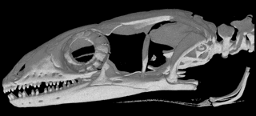
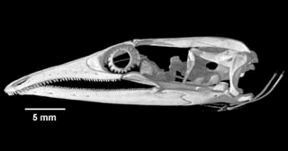

+++
title = "Main page"
+++

{{ resize_image(path="moloch.jpg", width=950, op="fit_width", class="center") }}

> With intermittent funding (too much of it out of my own pocket)
> and the help of a small army of colleagues and assistants from 1962 through
> 2008, I have gathered and analyzed extensive data on ecological relationships
> of lizard faunas of some 32 desert study sites, which lie at roughly similar
> latitudes on three continents: western North America, southern Africa, and
> Western Australia.



    <iframe class="map" src="https://www.google.com/maps/d/embed?mid=zpIWQxRgYrSw.kFqOL5tGUshk&hl=en&ll=1.62575,7.9541&z=1"></iframe>

In this interactive map, a series of 10-12 representative flatland desert areas
were selected for investigation on each continent.

Study sites are homogeneous and continuous, extensive enough to facilitate
sampling, and generally well suited for ecological analyses. Study areas
vary in size from about half a square kilometer to several square
kilometers.

Study sites exhibit a variety of habitat types, ranging from
simple vegetation to more complex structure. Five lizard families are
represented in the Kalahari, and seven occur in North America and
Australia.

Australian deserts have 21 lizard genera and 69 species,
African deserts 14 genera and 22 species, and North American deserts 12
genera and 14 species.

Together, these three continental desert-lizard
systems support 16 of the currently recognized 38 different lizard
families.



{{ resize_image(path="1986cover.jpg", width=250, op="fit_width", class="floatRight") }}

In 1986, I published a synthesis "Ecology and Natural History of Desert Lizards"
(Princeton Univ. Press) with extensive summaries of data collected from
1962-1979. Since then, I have been fortunate to collect many more data on
Australian lizards (12,634 new specimens) from 3 study sites. Many of these
species are uncommon but I have managed to acquire adequate sample sizes for
most. Understanding the ecology of rare species constitutes a major challenge
for ecologists
([Main 1982;](http://www.zo.utexas.edu/courses/THOC/RarityCorr.pdf)
[Thompson et al. 2003;](http://www.zo.utexas.edu/courses/THOC/RarityCorr.pdf)
[Pianka 2014](http://www.zo.utexas.edu/courses/THOC/RarityCorr.pdf)).
Some North American study sites have succumbed to urbanization, making my
1960's records of substantial historical and scientific interest.
Essentially they represent a recent fossil record of what was there before humans usurped
the habitat. Humans are bent on erasing the very signature of the evolution of
life on this Earth making it urgent that we read the [vanishing book before it
is destroyed](@/extra/vanishing.md) -- of course, we must also do our utmost to save
it for future generations to study.

I often receive requests for raw data, but I have seldom been able to provide
them. Originally, these data were collected primarily to elucidate niche
segregation and diversity, but many more innovative analyses should be
undertaken. For example, we offered an informative analysis of how frequently
lizards had empty stomachs ([Huey et al.
2001](http://www.zo.utexas.edu/courses/THOC/MT.pdf)). Another analysis used
dietary niche breadths to test food web theory ([Winemiller et al.
2001](http://www.zo.utexas.edu/courses/THOC/sixtests.pdf)). Still another study
demonstrated that deep history has had a profound impact on present day diets
([Vitt and Pianka 2005](http://www.zo.utexas.edu/courses/THOC/PNAS.pdf)). When
I die, I want my huge unique data set to be available to the next generation of
frustrated lizard ecologists ([Pianka
2016](http://www.zo.utexas.edu/faculty/pianka/Challenges.pdf)). This website
constitutes my attempt to pass on these data. My goal is to preserve for
posterity as much information as possible for each individual lizard (about
28,000 of them!). Accordingly, I have organized these data into a relational
database format. Data have been collated, organized and cross checked for
accuracy. These data are in a wide variety of formats: of those that have been
digitized, some are still simple text files, others are in MS Word or Excel
format, while others are Cricket Graph and Statview files. A substantial amount
of data on microhabitats for about 14,000 lizards have not yet been digitized
-- these should be entered into digital computer files. Lizards collected are
summarized in the following two tables.

---

| Desert       | Year     | No. of Sites | No. Species | No. Individuals |
|--------------|----------|--------------|-------------|-----------------|
| Great Basin  | 1962-64  | 3            | 4-5         | 558             |
| Mojave       | 1963-64  | 4            | 6-8         | 1407            |
| Sonoran      | 1963-69  | 5            | 7-10        | 2014            |
| Kalahari     | 1969-70  | 10           | 11-17       | 5375            |
| Australia    | 1966-68  | 8            | 15-39       | 2830            |
| Australia    | 1978-79  | 2            | 32-42       | 3003            |
| Totals       | 1962-79  | 32           | 4-42        | 15187           |

---

| Desert       | Year     | No. of Sites | No. Species | No. Individuals |
|--------------|----------|--------------|-------------|-----------------|
| Australia    | 1989-91  | 2            | 34-43       | 3873            |
| Australia    | 1992     | 3            | 28-33       | 1320            |
| Australia    | 1995-96  | 2            | 20-43       | 2676            |
| Australia    | 1998     | 2            | 36-37       | 2143            |
| Australia    | 2003     | 2            | 33-38       | 1435            |
| Australia    | 2008     | 2            | 38-40       | 1187            |
| Totals       | 1989-08  | 3            | 20-55       | 12634           |

---

Data acquired up until 1979 (first table) were summarized with totals and means
as appendices in Pianka (1986), but will now be made available in much greater
detail for each individual lizard. Ecology has changed dramatically in the past
couple decades, with much greater emphasis now being placed on conservation
biology, rare species, and phylogenetically corrected analyses of evolution
using modern comparative methods. Whereas data collected before 1979 were
intended for studying niche partitioning and community structure, data
collected since 1989 using pit traps (second table, above) were designed to
study rare species, fire succession, long-term change, habitat and microhabitat
requirements, adaptive radiations, and phylogenetic constraints. Thus, these
new data complement the older data and are qualitatively different than those
collected earlier. These new data have not yet been published and will be
organized and mined for new insights before they are put into the public domain
and made freely available and easily accessible to all.

This website contains tables with everything I know about each individual
lizard, including locality and date of collection, time of activity, body and
air temperature, snout-vent length (SVL), tail length plus tail condition,
fresh body weight, other head size and leg length morphometric variables,
microhabitat location or pit trap number, sex, reproductive condition, stomach
contents, and parasite load ([**Methods**](methods.html)). Auxiliary supporting
data on climate, snakes, birds, mammals, GPS coordinates of pit trap locations,
high-resolution aerial photographs with precise pit trap locations plotted on
them are also included. These data should be useful to a wide variety of
biologists, including conservation biologists, physiologists, and zoo
biologists.

# Projects that can be undertaken with these data:

1. Lizard faunas and foods eaten on the B-area have been examined at six
different time intervals in the fire succession cycle from original long
unburned to 13 years post-burn to better understand the dynamics of this
ecosystem ([Pianka and Goodyear
2014](http://www.zo.utexas.edu/courses/THOC/FireEcologyAustralEcology2012.pdf)).
These long-term census data provide insights in to how individual species
respond to fires (species composition, relative abundance, dietary flexibility,
and reproductive tactics). See also [Fire Succession on the
B-area.](http://www.zo.utexas.edu/faculty/pianka/BFS.html)

2. Habitat requirements of Australian species can be analyzed using extensive
pit trap records of many thousands of individuals of dozens of species over two
decades. Precise positions of pit traps plotted on low-level, high-resolution
aerial photographs should be analyzed using a geographical information system
(GIS) to assess habitat requirements of various species, as well as whether
species are positively or negatively correlated with each other over space and
time. See also: [Point-Diversity and Habitat
Requirements.](http://www.zo.utexas.edu/faculty/pianka/Point-Diversity-&-Hab-Req.html)

3. About two thirds of the species are uncommon -- these can now be better
characterized and I have finally been able to begin to attempt to understand
rarity (a major challenge facing ecologists). See also [Pianka
2014](http://www.zo.utexas.edu/courses/THOC/RarityCorr.pdf) and [Rarity in
Australian Desert
Lizards](http://www.zo.utexas.edu/faculty/pianka/Rarity.html).

4. Changes in relative abundances of species from site to site and through
time at two long-term study sites should be compared and related to fires,
climate change, and shrub encroachment.

5. Ecological and anatomical changes during ontogeny and sexual dimorphisms
between males and females should be examined. See also [Gender
Differences.](http://www.zo.utexas.edu/faculty/pianka/GenderDifferences.html)

6. Diets of diurnal species should be compared to those of nocturnal species.

7. Phylogenetically informed analyses of evolution of body and head size and
shape, as well as head and tail proportions among these desert lizards should
be undertaken. Some species are fossorial, others terrestrial, and still others
are arboreal. Tail length varies widely among species, with relatively short
tails in fossorial species (in some, the tail is shorter than snout-vent
length, SVL).

For example, among pygopodids, terrestrial species like _Pygopus_ have tails
about twice as long as SVL, whereas most _Delma_ have tails about 3 times SVL,
but exceedingly long tails up to 4 times SVL occur among two closely-related
arboreal pygopodid species (_Delma concinna_ and _Delma labialis_). Among the
six pygopodid genera, heads vary from shovel-like in fossorial species
(_Aprasia, Ophidiocephalus_) to blunt snouts (_Pygopus_) to various degrees of
long slender pointed snake-like noses (_Delma, Lialis_ and _Pletholax_). Head
morphologies can be related to ecologies (diets and microhabitats). We will
exploit the phylogeny reconstructed by Jennings et al. (2003) but will include
new sequences from additional slowly evolving nuclear genes (such as Rag-1) to
clarify deep phylogenetic relationships. Heads have been scanned in Dr. Timothy
Rowe's Digimorph laboratory using 3-dimensional high-resolution digital
catscans. Similar phylogenetically informed studies should be undertaken for
other species, especially for the species-rich Australian genus _Ctenotus_, but
also among North American and Kalahari species.



<table class="imageTable">
    <tr>
    <td align="center" valign="center">  </td>
    <td align="center" valign="center">  </td>
    </tr>
</table>

Catscans of skulls of _Pygopus_ and _Lialis_ (from Digimorph web site).
Heads have been scanned in Dr. Timothy Rowe's
Digimorph laboratory using 3-dimensional high-resolution digital catscans:

* [_Lialis brutonis_](http://digimorph.org/specimens/Lialis_burtonis/)
* See also: [Phylogenetic Reconstruction of Ancestral Traits.](http://www.zo.utexas.edu/faculty/pianka/Phylogenetics.html)



# Saving Pianka's Priceless Data

{{ resize_image(path="kalahari_pianka.jpg", width=400, op="fit_width", class="floatRight") }}
No-one will ever be allowed to replicate Pianka's monumental efforts to
understand the ecology and diversity of the world's desert lizards. Such
invaluable data will never again be assembled. He is now organizing his massive
data set to preserve them for use by future generations.
 Almost 28,000 specimens from three
continents representing more than 100 different species in 17 of the currently
recognized families of lizards have been safely deposited in major museums (DNA
samples of Australian species were also deposited in the Evolutionary Biology
Unit collection at the South Australian Museum in Adelaide.). Each specimen has
its own unique number with accompanying information on locality, date, habitat
and microhabitat, time, air and body temperature, fresh body weight, snout-vent
length, and tail length and condition. These data are lodged with each museum
as copies of field notes. Lizard specimens were also dissected and their sex
and reproductive condition assessed. Stomach contents were analyzed and
summarized. Ten body measurements were made on preserved specimens. Many of
these supplementary data remain at risk and will be lost with Pianka's demise
unless he can finish getting them digitized and entered into a data base. The
culmination of Pianka's life and work is now at stake -- as much information as
possible for each individual lizard should be preserved for posterity. These
data need to be organized in a relational database format describing different
types of data with queries to extract particular subsets. These data constitute
an invaluable resource for a wide variety of future studies, including seasonal
and long-term changes, ontogenetic changes, variation and sexual dimorphisms in
morphology and ecology (gender differences), microhabitat and habitat
requirements, thermal biology, reproductive biology, differences between
diurnal vs. nocturnal species, within-versus between-phenotype components of
niche breadth, dietary and microhabitat niche breadth and overlap, and point
diversity.

*   More on ERP's [Past Research
Projects](http://www.zo.utexas.edu/faculty/pianka/research.html)

## References

- Goodyear, S. E. and E. R. Pianka. 2011. Spatial and temporal variation in
diets of sympatric lizards (genus *Ctenotus*) in the Great Victoria Desert,
Western Australia. *J. Herpetology* 45: 265-271. [Read On
Line](http://www.bioone.org/doi/full/10.1670/10-190.1). [Download
pdf](http://www.zo.utexas.edu/courses/THOC/SEG+ERP-Ctenotus2011.pdf).

- Haydon, D. T., J. K. Friar, and E. R. Pianka. 2000a. Fire Driven Dynamic
Mosaics in the Great Victoria Desert I: Fire Geometry. *Landscape Ecology* 15:
373-381. [Abstract](http://www.zo.utexas.edu/courses/THOC/Fires1.html).
[Download pdf](mosaics1.pdf).

- Haydon, D. T., J. K. Friar, and E. R. Pianka. 2000b. Fire Driven Dynamic
Mosaics in the Great Victoria Desert II: A spatial and temporal landscape
model. *Landscape Ecology* 15: 407-423.
[Abstract](http://www.zo.utexas.edu/courses/THOC/Fires2.html). [Download
pdf](mosaics2.pdf).

- Huey, R. B. and J. J. Tewksbury. 2009. Can behavior douse the fire of climate
warming? *Proc. Nat. Acad. Sci.* 106: 3647-3648. [Download
pdf](http://www.pnas.org/content/106/10/3647.full).

- Huey, R. B., E. R. Pianka, and T. W. Schoener (eds.) 1983. *Lizard Ecology:
Studies of a Model Organism.* Harvard University Press. 501 pp.

- Huey, R. B., E. R. Pianka, and L. J. Vitt. 2001. How often do lizards "run on
empty?" *Ecology* 82: 1-7. [Download
pdf](MT.pdf).

- Jennings, W. B., E. R. Pianka, and S. Donnellan. 2003. Systematics of the
lizard family Pygopodidae with implications for the diversification of
Australian temperate biotas. *Systematic Biology* 52: 757-780. [Download
pdf](Pygopodids.2003.pdf).

- Kearney, M., R. Shine, and W. Porter. 2009. The potential for behavioral
thermoregulation to buffer "cold-blooded" animals against climate warming.
*Proc. Nat. Acad. Sci.* 106: 3835-3840. [Download
pdf](3835.pdf).

- Leistner, O. A. 1967. The plant ecology of the southern Kalahari. *Botanical
Survey of South Africa, Memoirs* 38: 1-172.

- Magurran, A. E. and P. A. Henderson 2003. Explaining the excess of rare
species in natural species abundance distributions. *Nature* 422 (6933):
714-716.

- Main, A. R. 1982. Rare species: precious or dross? In Graves, R. H. and W. D.
L. Ride (eds): *Species at risk: Research in Australia*, pp. 163-174.
Australian Academy of Science, Canberra. [Download
pdf](Main-Rarity.pdf).

- Milstead, W. W. (ed.). 1966. *Lizard Ecology: A Symposium.* University of
Missouri Press, Columbia. 300 pp.

- Morton, S. R. and C. D. James 1988. The diversity and abundance of lizards in
arid Australia: a new hypothesis. *American Naturalist*, 132: 237-256.
[Download pdf](MortonJames.pdf).

- Pianka, E. R. 1966. Convexity, desert lizards, and spatial heterogeneity.
*Ecology* 47: 1055-1059. [Download
pdf](convexity-1966.pdf).

- Pianka, E.R. 1967. On lizard species diversity: North American flatland
deserts. *Ecology* 48: 333-351. [Download
pdf](NAlizdiv.pdf).

- Pianka, E.R. 1969. Habitat specificity, speciation, and species density in
Australian desert lizards. *Ecology* 50: 498-502. [Download
pdf](HabSpec.pdf).

- Pianka, E.R. 1971. Lizard species density in the Kalahari desert. *Ecology*
52: 1024-1029. [Download
pdf](Kalahari.pdf).

- Pianka, E. R. 1973. The structure of lizard communities. *Annual Review of
Ecology and Systematics* 4: 53-74. Selected as "This Week's Citation Classic"
in *Current Contents* (Agriculture, Biology & Environmental Sciences) (1988),
volume 19 (number 35): page 18. [Download
pdf](ARES.pdf).

- Pianka, E. R. 1974. Niche overlap and diffuse competition. *Proc. Nat. Acad
Sci.* 71: 2141-2145. [Download
pdf](PNAS1974.pdf).

- Pianka, E. R. 1975. Niche relations of desert lizards. Chapter 12 (pp.
292-314) in M. Cody and J. Diamond (eds.) *Ecology and Evolution of
Communities.* Harvard University Press.

- Pianka, E. R. 1986. *Ecology and Natural History of Desert Lizards. Analyses
of the Ecological Niche and Community Structure.* Princeton University Press,
Princeton, New Jersey.

- Pianka, E. R. 1996. Long-term changes in Lizard Assemblages in the Great
Victoria Desert: Dynamic Habitat Mosaics in Response to Wildfires
