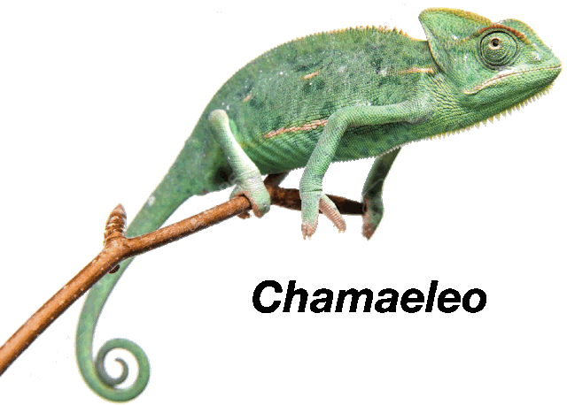
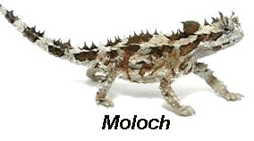
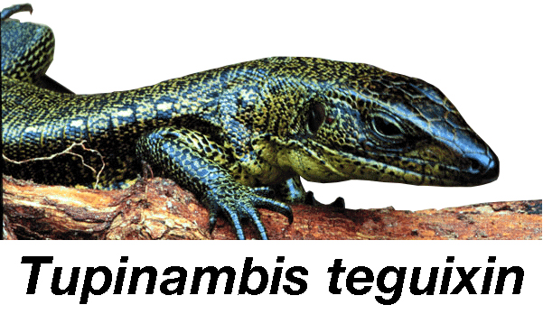
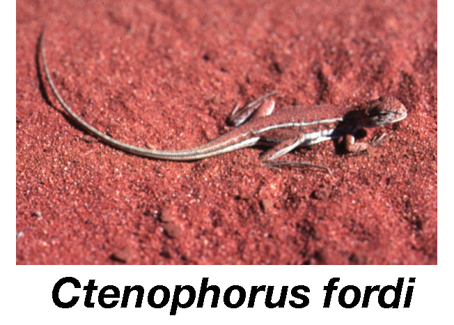
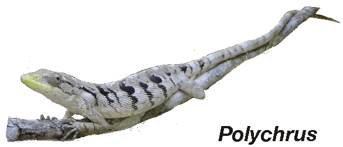
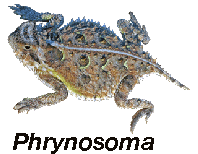
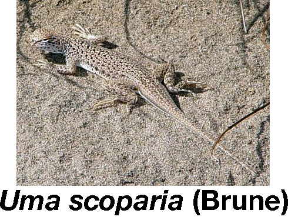

+++
title = "Additional Content"
template = "extra.html"
+++

# Exploring the Lizard Niche Hypervolume
<table style="display:inline-block;">
    <tr><td></td></tr>
    <tr><td></td></tr>
    <tr><td></td></tr>
    <tr><td></td></tr>
</table>

| model | description |
| --- | --- |
| [Model 1](./model1) | 51 niche dimensions |
| [Model 2](./model2) | 10 Convergent Pairs |
| [Model 3](./model3) | Habitat Types |
| [Model 4](./model4) | Foraging Mode plus Trophic Dimension |
| [Model 5](./model5) | Life History Dimension |
| [Model 6](./model6) | Metabolic Dimension |
| [Model 7](./model7) | Arboreal vs. Terrestrial |
| [Model 8](./model8) | Body Temp x Ambient Temp Slope |
| [Model 9](./model9) | Clutch Frequency |
| [Model 10](./model10) | Foraging Mode |
| [Model 11](./model11) | 4 Geographic Regions |

<table style="display:inline-block;">
    <tr><td></td></tr>
    <tr><td></td></tr>
    <tr><td></td></tr>
    <tr><td></td></tr>
</table>
